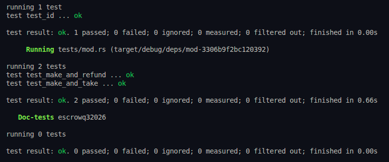

# Q3 Escrow

## Features

- **Timed Escrow Design:** Escrows are built with a built-in time-bound execution mechanism using the `Clock` sysvar.
- **Non-Custodial:** The escrow operates through PDAs ensuring decentralized, trustless swaps.
- **SPL Token Support:** Accepts and swaps generic SPL tokens.
- **Secure Redemptions:** Takers can execute swaps strictly before the escrow expires. If the escrow expires, only the Maker can retrieve their initial deposit.
- **Efficient State Management:** Securely closes vault PDAs and returns rent lamports to the user upon completion or refund.

## Instructions

- `Make`: Initializes the escrow state, sets up the token vault PDA, configures the exchange conditions (requested amount & expiration), and deposits the maker's tokens.
- `Take`: Allows a taker to fulfill the escrow by depositing the requested tokens to the maker, while securely withdrawing the maker's deposited tokens to their own account. Closes the escrow. (Must be executed _before_ expiration).
- `Refund`: Allows the maker to reclaim their deposited tokens and close the escrow if it remains unfulfilled. (Must be executed _after_ expiration).

## Testing

The escrow is comprehensively tested using native Rust and **LiteSVM** (`litesvm` & `litesvm-token`). The test suite avoids relying on a local validator, making it exceptionally fast.

To run the tests:

```bash
cargo test
```



To build the program and generate the IDL:

```bash
anchor build
```

## Dependencies

- Anchor Framework (v1.1.2)
- Solana Program & SDK (v3.x / v4.x)
- LiteSVM (v0.10.0)
